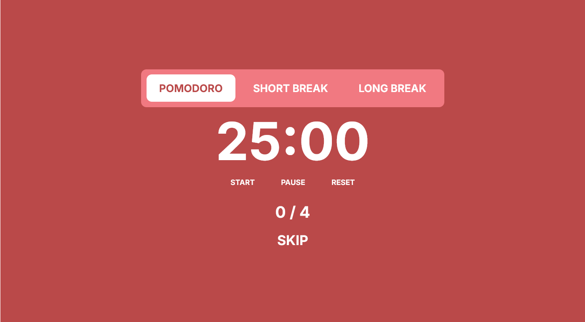

# 🍅 Pomodoro Timer

> Maximize sua produtividade com a técnica Pomodoro

<div align="center">


</div>

## ✨ Sobre o Projeto

Um timer Pomodoro moderno e elegante construído com React, TypeScript e Vite. A técnica Pomodoro é um método de gerenciamento de tempo que usa intervalos de trabalho focado seguidos por pausas curtas para maximizar a produtividade.

### 🎯 Como Funciona

- **25 minutos** de trabalho focado
- **5 minutos** de pausa curta
- A cada 4 pomodoros, **15** de pausa longa

## 🚀 Funcionalidades

- 📊 Contador de pomodoros completados
- 🎨 Interface moderna e responsiva
- 📱 Totalmente responsivo

## 🛠️ Tecnologias

- **React 18** - Biblioteca para interfaces
- **TypeScript** - Tipagem estática
- **Vite** - Build tool moderna
- **CSS3** - Estilização avançada

## 📦 Instalação

```bash
# Clone o repositório
git clone https://github.com/seu-usuario/pomodoro-timer.git

# Entre no diretório
cd pomodoro-timer

# Instale as dependências
npm install

# Execute o projeto
npm run dev
```

## 🎮 Como Usar

1. **Inicie o timer** clicando no botão play
2. **Trabalhe focado** durante os 25 minutos
3. **Faça uma pausa** quando o timer tocar
4. **Repita o ciclo** para maximizar sua produtividade

## 📱 Preview

<div align="center">



*Interface moderna e intuitiva do Pomodoro Timer*

</div>

</div>